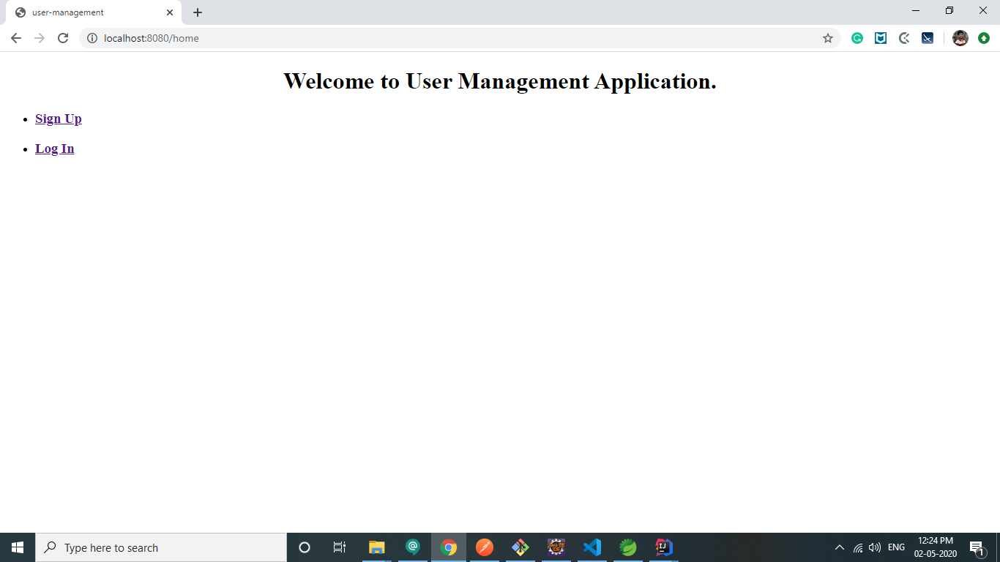
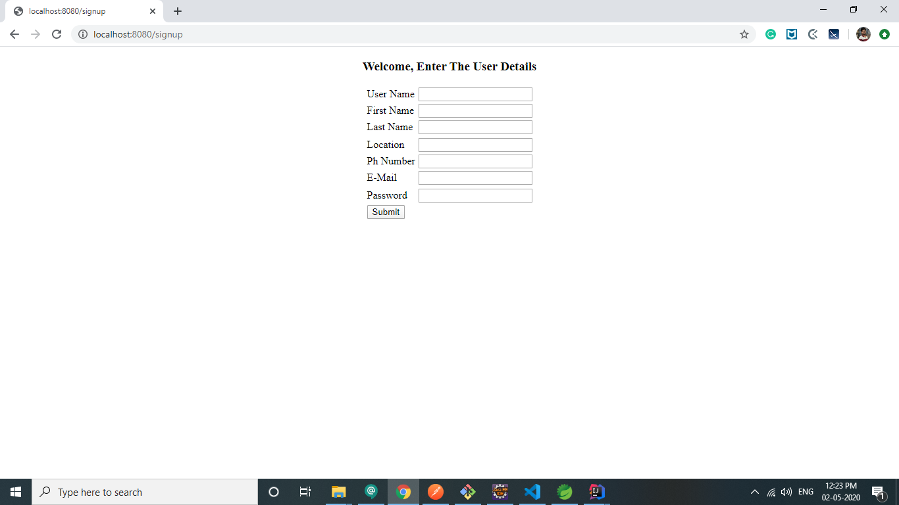
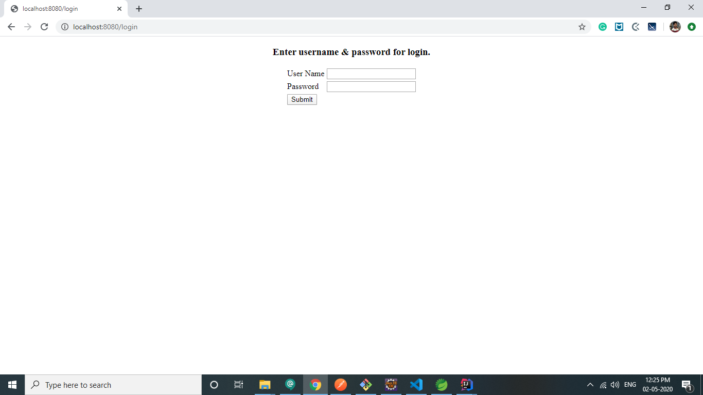
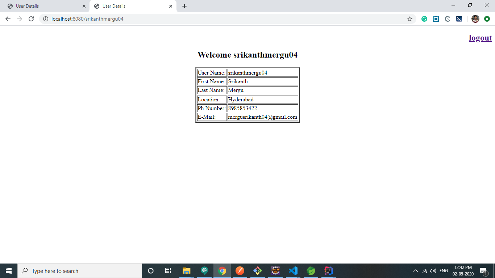

# user-management
user-management spring boot application

## APIs
- Home Page API:
``
"http://localhost:8080/home" or "http://localhost:8080/"
``
- Signup Page API:
``
"http://localhost:8080/signup"
``
- Login Page API:
``
 "http://localhost:8080/login"
``
- UserDetails API:
``
 "http://localhost:8080/{userName}"
``
- Logout API:
``
 "http://localhost:8080/logout"
``

**1.Home Page:**
``
"http://localhost:8080/home" or "http://localhost:8080/"
``

**2.Signup API:**
``
"http://localhost:8080/signup"
``

**3.Login API:**
``
 "http://localhost:8080/login"
``

**4.User Details API:**
``
 "http://localhost:8080/{userName}"
``

